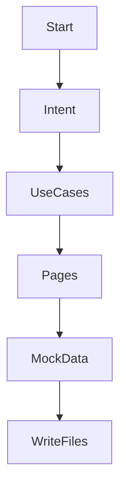
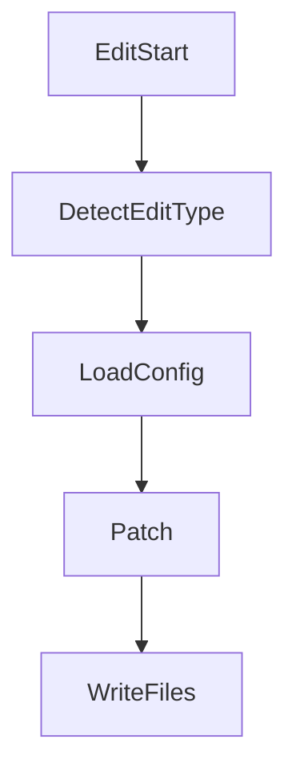
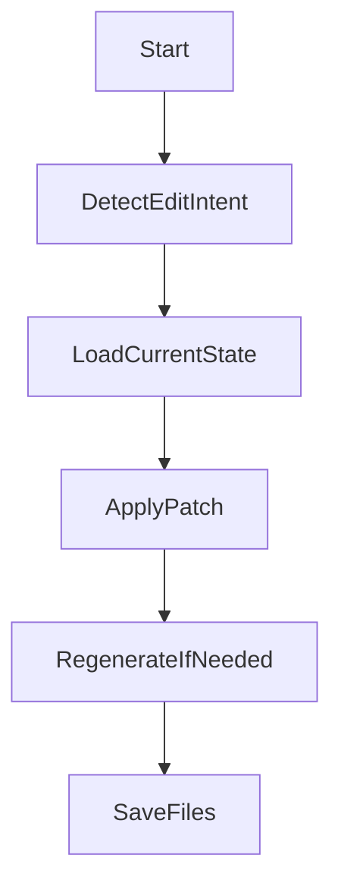

Absolutely! Let’s lock in the **complete feature set and responsibilities** of your LangGraph-powered agent so you can build with full clarity.

---

## ✅ Agent Name: `InternalAppBuilderAgent`

This agent takes a user query and turns it into a **fully functional internal tool**, driven by a config and mock data.

---

## 🧠 CORE CAPABILITIES

| Area | Feature |
|------|---------|
| 🎯 Input Understanding | Accepts natural language queries like: _“Build a tool to manage OKRs and reviews”_ |
| 📋 Use Case Generation | Extracts use case details, roles, entities, workflows |
| 🧱 Page & Component Generation | Creates page config with zones and prop-driven components |
| 📦 Mock Data Generator | Generates realistic records per entity for mock API |
| ⚙️ JSON Output | Saves `appConfig.json` and `mock-data/*.json` files |
| 🔁 Edit Flow Support | Can patch/update config or mock data based on user changes |
| 📤 Modular Output | All outputs ready to be loaded into the base app on Freestyle |

---

## 📊 FEATURES IN DETAIL

### 1. 🧠 **Intent Analysis**
- Extracts:
  - App name
  - Primary use case
  - High-level goals

---

### 2. 🧩 **Use Case & Entity Design**
- Defines:
  - Main entities (`tasks`, `reviews`, `okrs`, etc.)
  - Fields and types per entity
  - Relationships between entities
- Optional: roles & permissions

---

### 3. 🧱 **Page and UI Blueprinting**
For each entity or workflow, it generates:
- Pages:
  - Name, route, icon
  - Zones within the page
- Components:
  - `DataTable`, `Form`, `MetricCard`, `Chart`, etc.
  - Fully populated `props` to be rendered dynamically

---

### 4. 📦 **Mock API Data**
- Generates 5–10 sample records per resource
- Output format: `{resource}.json` files
- Each record uses plausible field values (e.g., names, status, dates)

---

### 5. 📁 **File Output**
- Writes:
  - `src/config/appConfig.json`
  - `src/mock-data/{resource}.json`
- (Optional) `meta.json` for internal debug info

---

### 6. ✏️ **Edit Flow**
Supports:
- Updating a page or subpage (e.g., "add a chart to dashboard")
- Editing a field (e.g., "change due_date to optional")
- Adding new components
- Regenerating mock data for updated resources

Includes:
- Detection of edit intent
- Loading of current config
- Patch/merge logic (using `deepmerge` or JSON diff)

---

## 🗂️ Output Files Summary

| File | Description |
|------|-------------|
| `appConfig.json` | Complete page/component config |
| `mock-data/*.json` | Sample data for each entity |
| `meta.json` (optional) | Use case metadata (entities, relationships, etc.) |

---

## 🧩 Example AgentState Model

```python
class AgentState(BaseModel):
    user_input: str
    app_name: Optional[str]
    use_case_summary: Optional[str]
    entities: List[Dict[str, Any]] = []
    pages: List[Dict[str, Any]] = []
    page_configs: Dict[str, Any] = {}
    mock_data: Dict[str, List[Dict[str, Any]]] = {}
    current_config: Optional[Dict[str, Any]] = None
    mode: Literal["create", "edit"] = "create"
```

---

## 🔀 Flow Graph Overview



Edit Flow:



---

## 🧠 LangGraph Implementation Plan

- Use `StateGraph[AgentState]` with branching on `mode`
- Define nodes for:
  - `analyze_user_intent`
  - `generate_use_cases`
  - `generate_page_configs`
  - `generate_mock_data`
  - `write_files`
- For edit flow:
  - `detect_edit_target`
  - `load_existing_config`
  - `apply_patch`

---

## ✅ You’re Ready To Build

Next steps:
1. Scaffold the project with LangGraph
2. Implement steps as callable tools
3. Start with mocked AI responses → then add real OpenAI calls
4. Hook up file output

---

Perfect — let’s deep-dive into designing your **LangGraph-based `create_agent`**, without diving into code. We’ll define:

1. **Each step's responsibilities**  
2. **Input and output for each step**  
3. **Things to take care of at each step**  
4. **Why each step exists (value it adds)**

---

## 🧠 `create_agent` Overview (LangGraph Flow)

The create agent runs a flow like this:

```
[User Query] ➝ Intent Analysis ➝ Use Case Generation ➝ Page Config Generation ➝ Mock Data Generation ➝ Output Writer
```

Each step builds upon the previous one using a shared `AgentState`.

---

## 🪜 STEP-BY-STEP FLOW DESIGN

---

### 🔹 Step 1: `analyze_user_intent`

**Goal:** Understand the app the user wants.

#### 📥 Input:
- `user_input` (raw text prompt)

#### 📤 Output:
- `app_name`: inferred or explicitly extracted
- `use_case_summary`: what this app is meant to do

#### ✅ Things to take care of:
- Ensure app name is **short, clean, title-cased**
- Summarize **real business value** (helps next steps)
- If not enough context → flag for future prompt clarification (not in MVP)

---

### 🔹 Step 2: `generate_use_cases`

**Goal:** Define what this app will consist of functionally and structurally.

#### 📥 Input:
- `use_case_summary`

#### 📤 Output:
- `entities[]`: list of data entities (e.g., `okr`, `review`)
  - Each entity includes name, fields, and relationships
- `pages[]`: list of high-level pages needed
  - Each with title, path, icon, and role/purpose

#### ✅ Things to take care of:
- Fields must include:
  - `name`, `type`, `required?`, `options` (for enums)
- Use common field types: `string`, `number`, `boolean`, `select`, `date`
- Detect relationships (e.g., `user_id` foreign key)
- Pages must align with entities and key workflows (e.g., Dashboard, Reports)

---

### 🔹 Step 3: `generate_page_configs`

**Goal:** Turn use cases into a valid UI config that the base app understands.

#### 📥 Input:
- `pages[]`
- `entities[]`

#### 📤 Output:
- `page_configs`:
  - JSON structure with pages → zones → components
  - All component types with fully defined `props`

#### ✅ Things to take care of:
- Use predefined component types: `MetricCard`, `DataTable`, `SimpleForm`, `Chart`, etc.
- Each zone has:
  - `title`, `subtitle` (optional)
  - `components[]`
- Component `props` must:
  - Be valid and match expectations
  - Reference the correct `resource` or entity
- Default to:
  - `DataTable` + `SimpleForm` for each entity page
  - `MetricCard` on dashboard
- Page config must be valid JSON and match app schema

---

### 🔹 Step 4: `generate_mock_data`

**Goal:** Provide sample data to make the app immediately usable.

#### 📥 Input:
- `entities[]` with field definitions

#### 📤 Output:
- `mock_data`: dictionary of `{resource_name: [rows]}`

#### ✅ Things to take care of:
- Minimum 5–10 records per resource
- Ensure:
  - Foreign keys use matching IDs
  - Dates are realistic
  - Select fields use valid enum values
- Can use faker-style templating for values
- Output in memory first — file write happens later

---

### 🔹 Step 5: `write_output_files`

**Goal:** Save all results to disk for use by the base app.

#### 📥 Input:
- `app_name`, `page_configs`, `mock_data`

#### 📤 Output:
- Files:
  - `src/config/appConfig.json`
  - `src/mock-data/{resource}.json`

#### ✅ Things to take care of:
- Ensure paths exist or are created
- Clean formatting (indent=2, UTF-8)
- Fail gracefully on file system errors
- Use app name to organize folders (optional for multi-app support later)

---

## 🔁 State Tracking Throughout the Flow

- `AgentState` carries forward the cumulative state
- If any step fails → log partial state
- Future: You can persist this state in DB or JSON and allow resuming

---

Absolutely! Let’s now define the **`edit_agent` flow** in LangGraph — this agent builds on the `create_agent` but is designed for **incremental updates** to an already generated app.

---

## 🧠 `edit_agent` Overview

> Accepts a user prompt like:  
> _“Change the dashboard to include a chart showing tasks completed per assignee”_  
> …and intelligently updates the relevant part of the app config and/or mock data.

---

## 🎯 Goal

- Load the **existing app state** (`appConfig.json`, `mock-data/*.json`)
- Analyze the user’s **modification intent**
- Determine which part of the system to update:
  - Pages
  - Components
  - Props
  - Data records
- Apply the patch in memory
- Save the updated files

---

## 🪜 Flow Steps (LangGraph)



---

## 🧩 Step-by-Step Breakdown

---

### 🔹 Step 1: `detect_edit_intent`

**Goal:** Figure out what kind of change the user wants.

#### 📥 Input:
- `user_input`

#### 📤 Output:
- `edit_target`: enum like `page`, `component`, `data`, `field`, `style`
- `target_page`: e.g., `"Dashboard"`
- `target_component`: e.g., `"DataTable"`, `"Chart"`
- `operation`: `"add"`, `"remove"`, `"update"`
- `modification_details`: raw description or structured diff

#### ✅ Notes:
- Can use OpenAI function calling with a schema to extract structured edits
- Must gracefully ask for clarification if ambiguous

---

### 🔹 Step 2: `load_current_state`

**Goal:** Load current JSON files for config and data.

#### 📥 Input:
- `app_name` or path

#### 📤 Output:
- `current_config` (parsed `appConfig.json`)
- `mock_data` (dict of all resource JSON)

#### ✅ Notes:
- Validate config structure (optional)
- Optionally track config version (for rollback later)

---

### 🔹 Step 3: `apply_patch`

**Goal:** Apply the described change to the in-memory config or data.

#### 📥 Input:
- `current_config`
- `edit_target`, `modification_details`

#### 📤 Output:
- `updated_config`
- `updated_data` (optional)

#### ✅ Notes:
- Use `deepmerge`, `jsonpatch`, or manual logic
- Ensure that modifications:
  - Preserve component schema
  - Keep layout valid
- Track what was changed for audit/debug purposes

---

### 🔹 Step 4: `regenerate_if_needed`

**Goal:** If a change affects data schema (e.g., new field), update data files too.

#### 📥 Input:
- `updated_config`, `edit_target`, `modification_details`

#### 📤 Output:
- Updated `mock_data` if affected (e.g., added column → regenerate sample rows)

#### ✅ Notes:
- Auto-fill new fields with sensible values
- Ensure existing records aren’t broken

---

### 🔹 Step 5: `save_files`

**Goal:** Write updated config and data back to disk.

#### 📥 Input:
- `updated_config`, `updated_data`

#### 📤 Output:
- Overwrites:
  - `src/config/appConfig.json`
  - `src/mock-data/*.json`

#### ✅ Notes:
- Validate JSON structure before writing
- Use temp files first if needed (for rollback)

---

## 🧠 Optional: Edit Types to Support (MVP)

| Edit Type | Example Prompt | Action |
|-----------|----------------|--------|
| Add Page | “Add a Feedback page with a form” | Append to `pages[]` |
| Add Component | “Add a Chart to Dashboard” | Add component to `zones[].components[]` |
| Modify Props | “Change the chart’s groupBy to department” | Patch a component’s `props` |
| Change Field | “Make due_date optional” | Modify `fields[]` in form |
| Edit Data | “Add sample task with status ‘in review’” | Append to mock data |
| Delete Component | “Remove the MetricCard from Dashboard” | Remove from config tree |

---

## 🗂️ AgentState Additions for Edit Flow

```python
class AgentState(BaseModel):
    ...
    mode: Literal["create", "edit"]
    edit_target: str | None = None
    modification_details: dict | None = None
    current_config: dict | None = None
    updated_config: dict | None = None
    updated_data: dict | None = None
```

---
Perfect — you’re now ready to **wrap the agent in a backend server** that exposes it via HTTP + WebSocket to power your frontend UI.

Let’s define the full **API design**, **server architecture**, and **how it integrates with LangGraph flows** — so the frontend can trigger agents, stream updates, and display final results.

---

## 🧠 Server Goal

- Expose a single endpoint to handle **agent requests** from frontend
- Trigger `create_agent` or `edit_agent` flows
- Stream real-time updates (step-by-step) via **WebSocket**
- Save each app as a project (multi-session support)
- Persist final config + mock data

---

## 🌐 HTTP API DESIGN

### ✅ POST `/agent/run`

> Trigger `create` or `edit` flow

#### 📥 Request Body:
```json
{
  "project_id": "abc123",         // unique session/app identifier
  "mode": "create",               // or "edit"
  "user_input": "Build a task tracker",
  "chat_history": [ ...optional ],
  "user_id": "u_12345"
}
```

#### 📤 Response:
```json
{
  "status": "started",
  "project_id": "abc123",
  "ws_channel": "agent-updates-abc123"
}
```

---

### ✅ GET `/project/:id`

> Fetch saved config + mock data for a project

#### 📤 Response:
```json
{
  "project_id": "abc123",
  "appConfig": { ... },
  "mockData": {
    "tasks": [...],
    "users": [...]
  }
}
```

---

### ✅ (Optional) GET `/projects`

> List all apps created by user

---

## 🔁 WebSocket Design

### Connect to: `/ws/:project_id`

- On connect: stream status messages

### WebSocket Events:
```json
{ "type": "status", "step": "analyze_user_intent", "message": "Analyzing user intent..." }

{ "type": "state", "step": "generate_pages", "data": { "pages": [...] } }

{ "type": "complete", "message": "App successfully generated", "config": {...}, "mockData": {...} }

{ "type": "error", "step": "generate_mock_data", "error": "Field type mismatch" }
```

> Frontend can show these in a chat stream, like an AI-powered dev log.

---

## 🏗️ BACKEND ARCHITECTURE

| Layer | Description |
|-------|-------------|
| FastAPI / Express | HTTP server to receive agent calls |
| LangGraph | Agent runner (create/edit) |
| SQLite / JSON | Persistent store for project state |
| WebSocket (FastAPI / socket.io) | Real-time updates |
| File system / S3 | Store output configs and mock data |

---

## 🔄 Integration with LangGraph

### 1. Server receives POST `/agent/run`
- Stores initial state in DB
- Kicks off `create_agent.run(...)` in async/background
- Registers a **callback** for each LangGraph step

### 2. Inside each LangGraph step:
- Send WebSocket update:
  ```python
  send_ws(project_id, {
    "type": "status",
    "step": "generate_mock_data",
    "message": "Generating sample data..."
  })
  ```

- When step returns state:
  ```python
  send_ws(project_id, {
    "type": "state",
    "step": "generate_pages",
    "data": { "pages": [...] }
  })
  ```

### 3. On success/failure:
- Send final `complete` or `error` message
- Save final `appConfig` and `mock-data` to DB/files

---

## 🔐 Future-Proof Additions (Optional)

| Feature | API / Layer |
|--------|-------------|
| Authenticated users | Stack Auth + token |
| Resume previous flow | `GET /project/:id/state` |
| Versioning | Save previous config versions |
| Deploy-to-Freestyle | Trigger script/deploy from server |
| Send to Onlook | Add button to open config in Onlook

---

Would you like me to generate:
- API spec as an OpenAPI doc?
- A full folder scaffold (`/routes`, `/flows`, `/sockets`)?
- Or just the `ws` + `agent-run` controller logic? just this logic needs to be built
Absolutely — let's now integrate **SQLite** into the architecture to support persistence for:

- Projects  
- App generation state  
- Config files and mock data  
- Versioning (optional but supported easily)

SQLite is perfect for this because it's:
- 🛠️ Zero-config
- 🪶 Lightweight
- 💾 File-based — perfect for a hackathon, prototyping, or local deployments

---

## 🧱 SQLite DB Integration for Agent Server

---

### 🗂️ What To Store in SQLite

| Table | Purpose |
|-------|---------|
| `projects` | Track each app generation session |
| `configs` | Store `appConfig.json` (latest + versions) |
| `mock_data` | Store per-resource mock data as JSON blobs |
| `messages` | Track WebSocket message history (for audit or chat replay) |

---

## 🗃️ Table Definitions (SQLite Schema)

```sql
-- Project metadata
CREATE TABLE projects (
  id TEXT PRIMARY KEY,
  user_id TEXT,
  name TEXT,
  mode TEXT, -- 'create' or 'edit'
  created_at TIMESTAMP DEFAULT CURRENT_TIMESTAMP,
  updated_at TIMESTAMP DEFAULT CURRENT_TIMESTAMP
);

-- Latest app config
CREATE TABLE configs (
  project_id TEXT,
  version INTEGER,
  config_json TEXT,
  created_at TIMESTAMP DEFAULT CURRENT_TIMESTAMP,
  PRIMARY KEY (project_id, version)
);

-- Mock data per resource
CREATE TABLE mock_data (
  project_id TEXT,
  resource_name TEXT,
  data_json TEXT,
  created_at TIMESTAMP DEFAULT CURRENT_TIMESTAMP,
  PRIMARY KEY (project_id, resource_name)
);

-- WebSocket messages for replay/debug
CREATE TABLE messages (
  project_id TEXT,
  step TEXT,
  type TEXT,
  content TEXT,
  created_at TIMESTAMP DEFAULT CURRENT_TIMESTAMP
);
```

---

## 📦 Project Folder Layout (SQLite + LangGraph)

```
/server
├── db/
│   └── database.db            # SQLite file
├── models/
│   ├── schema.sql             # Initial migration
│   ├── orm.py                 # Query helpers
├── flows/
│   └── create_agent.py        # LangGraph flow
├── routes/
│   └── agent.py               # /agent/run
├── ws/
│   └── socket_handler.py      # WebSocket router
├── utils/
│   └── storage.py             # Save config/mock to DB
├── app.py                     # FastAPI or Express entrypoint
```

---

## 🔁 Workflow with SQLite

### 1. User starts generation:
- Insert into `projects`
- Insert empty `configs` version 0
- Insert empty `mock_data` entries

---

### 2. As steps run:
- After each step, update `projects.updated_at`
- Store intermediate state optionally

---

### 3. On step success:
- `configs`: insert new version (increment from last)
- `mock_data`: upsert for each `resource_name`
- `messages`: insert `status`, `state`, `complete` logs

---

### 4. On frontend:
- `GET /project/:id` loads config + mock_data
- WebSocket listens on `agent-updates-{project_id}`

---

## ✍️ Things to Take Care of

| Topic | Recommendation |
|-------|----------------|
| JSON storage | Use `json.dumps` / `json.loads` to store dicts |
| Versioning | Keep incrementing `configs.version` |
| Concurrency | SQLite supports one writer at a time — use locks if needed |
| Backup | Periodically copy `database.db` file |
| Future DB | Easy to migrate to Postgres by keeping ORM interface clean

---

## 🔄 Example: Saving Config

```python
def save_config(project_id, config_json):
    latest_version = db.get_max_version(project_id)
    db.insert("configs", {
        "project_id": project_id,
        "version": latest_version + 1,
        "config_json": json.dumps(config_json)
    })
```

---

Would you like:
- SQLAlchemy or Peewee model setup?
- Helper functions like `get_latest_config(project_id)` or `save_mock_data(project_id, resource, rows)`?
- Or a migration script to initialize the schema?
